# Projeto CI/CD com Github Actions (manifestos)
Projeto feito no Windows para simular o CI/CD de uma empresa com Github Actions e Argo CD, com o Github como fonte de verdades.  
Argo CD é a ferramenta declarativa de entrega contínua (CD) e de GitOps para o Kubernetes.
# O que foi usado
Para este projeto, estes foram os "itens" usados:  
- Github com repositórios públicos  
- Conta no Docker Hub (com token de acesso)  
- Docker desktop  
- Cluster local (Kind) com ArgoCD instalado  
- Git  
- Python 3  
- Kubernetes
- [O repositório da aplicação](https://github.com/damascenojoao3/hello-app)
Uma recomendação é usar o VS Code com o terminal ativado pra fazer push mais facilmente pro Github, facilita todo o processo.  
Primeiramente, comece com a criação de dois repositórios no Github, um para o arquivo main.py (e mais alguns que serão explicados) e um (esse mesmo) para os manifestos.  
Com isso, podemos iniciar por etapas:  
# Etapa 1 - App
A etapa 1 é, basicamente, a primeira parte de um todo, e pode ser vista [no repositório da aplicação](https://github.com/damascenojoao3/hello-app).  
# Etapa 2 - Manifestos
Com a 1° etapa pronta, podemos dar início à segunda, e nela, é ainda mais simples: basta adicionar os arquivos de [deployment](deployment.yaml) e [service](service.yaml).  
O arquivo de deployment serve para controlar o estado dos Pods que serão criados. Se você atualizar o main.py, ele executa o rollout (substituição dos pods).  
O arquivo de service é o "endereço" do aplicativo. Ele roteia o tráfego que chega para a porta 80 (do service) para a porta 8000 (do container), e faz isso de forma consistente, mesmo que os pods por trás dele morram e sejam recriados.  
Quando tudo já estiver funcionando, você vai perceber que, no arquivo de deployment, vai ter uma "baixa" nas linhas (e uma "novidade"), essa é a linha atualizada.  
Juntos, garantem que sua aplicação esteja acessível e rodando! Agora, o repositório que será usado pelo ArgoCD está pronto!  
# Etapa 3 - ArgoCD
Para dar início ao processo do ArgoCD, é necessário baixar o Kind. Ele é necessário para fazer o cluster local. Para baixá-lo, vá no navegador e cole esse link na pesquisa:  
```https://kind.sigs.k8s.io/dl/v0.30.0/kind-windows-amd64```  
Após isso, renomeie o arquivo baixado para ```kind.exe``` e mova-o para a pasta ```System32``` (C:\Windows\System32). Após isso, para testar o Kind, abra o terminal e use o comando:  
````kind --version```  
Se aparecer a versão do Kind, deu certo!  
Agora, com o funcionamento do Kind testado, siga os passos abaixo:  
1. Volte ao terminal e use este comando:  
```kind create cluster --name argocd-cluster```  
Ele cria o cluster e configura o Docker para usá-lo como contexto, fazendo o kubectl funcionar. Pode demorar um pouco.  
Após a criação e mais alguns minutos, você já pode fazer o teste com este comando:  
```kubectl get nodes```  
Se retornar o nome, o status ```Ready``` e as outras informações, deu certo!  
Agora, execute os comandos  
```kubectl create namespace argocd```;
```kubectl apply -n argocd -f https://raw.githubusercontent.com/argoproj/argo-cd/stable/manifests/install.yaml``` (esse demora um pouco)  
Após realizar o último comando, use o comando ```kubectl get pods -n argocd``` para ver se está funcionando. Ele tem que mostrar informações como as abaixo:  
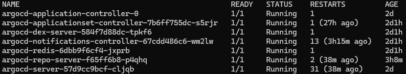  
2. Agora que o ArgoCD está configurado:  
Use este comando:  
```kubectl port-forward svc/argocd-server -n argocd 8080:443```  
Ele fará o site do ArgoCD ficar disponível para você usar.  
Agora, abra seu navegador e digite ```http://localhost:8080``` e você estará no ArgoCD!  
3. No ArgoCD:  
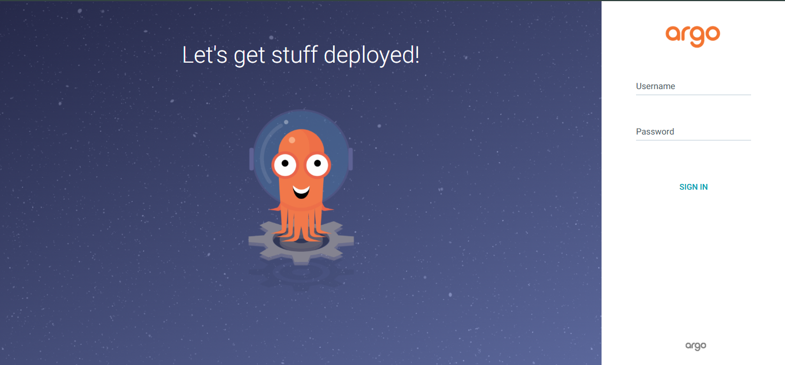  
Seu username sempre será ```admin``` e sua senha é obtida no terminal usando o comando:  
```(kubectl -n argocd get secret argocd-initial-admin-secret -o jsonpath="{.data.password}" | Out-String) -replace '\s' | ForEach-Object { [System.Text.Encoding]::UTF8.GetString([System.Convert]::FromBase64String($_)) }```  
Copie o resultado e volte ao ArgoCD e insira tal resultado na senha (sim, esse resultado maluco é sua senha) e clique em sign in.  
4. Agora que está no ArgoCD, siga:  
Clique em ```+ NEW APP```
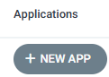  
Escolha um nome para a sua aplicação, selecione ```default``` como nome do projeto e ```Automatic``` em ```SYNC POLICY```  
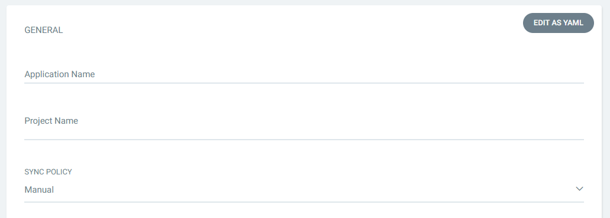  
Desça até ```Source``` e cole o link do seu repositório com os manifestos e em ```Path``` digite ```.```, ele vai ler a raiz do seu repositório  
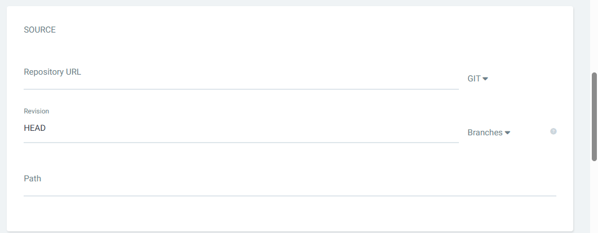  
Desça mais um pouco até ```DESTINATION```, clique em ```Cluster URL``` e selecione a única opção (```https://kubernetes.default.svc```) e, em ```Namespace```, digite ```default```
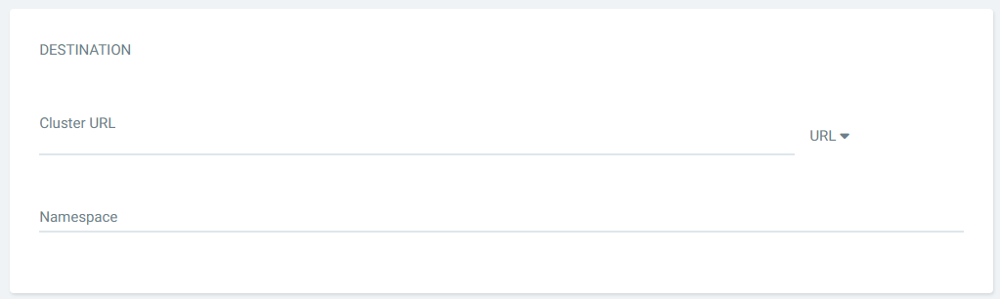  
Agora, no canto superior esquerdo, clique em ```CREATE```e sua aplicação estará pronta!  
  
Vai aparecer uma nova aplicação na sua tela principal e, depois de um tempo, se tudo tiver dado certo, sua tela vai aparecer assim:  
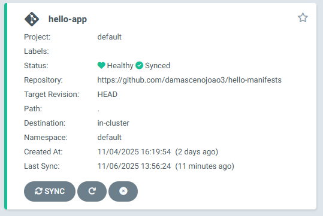  
# Etapa 4 - Fim/testes
Com tudo pronto, você pode iniciar seus testes! O primeiro deles é port-forwarding do seu aplicativo. Para isso, volte ao terminal e dê ```ctrl+c``` para parar o ArgoCD e dê esse comando:  
```kubectl port-forward svc/hello-app-service 8080:80 -n default```  
Volte no navegador e digite ```http://localhost:8080```  
Você deve ver algo parecido com isso:  
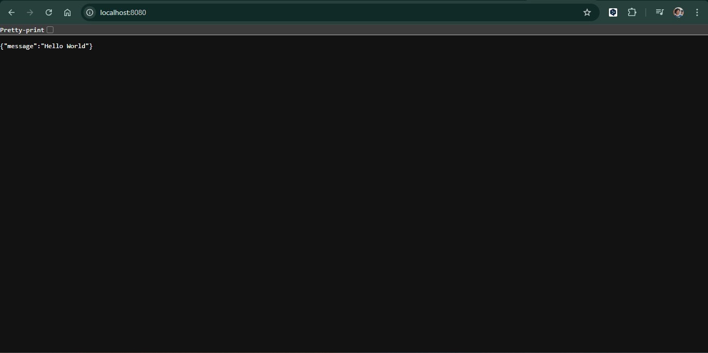  
Para o próximo teste, você pode testar suas Actions:  
Dê ```ctrl+c``` no terminal para parar o app;  
Vá para o repositório do seu app e vá até o ```main.py``` e faça qualquer mudança (mudei a mensagem no exemplo)  
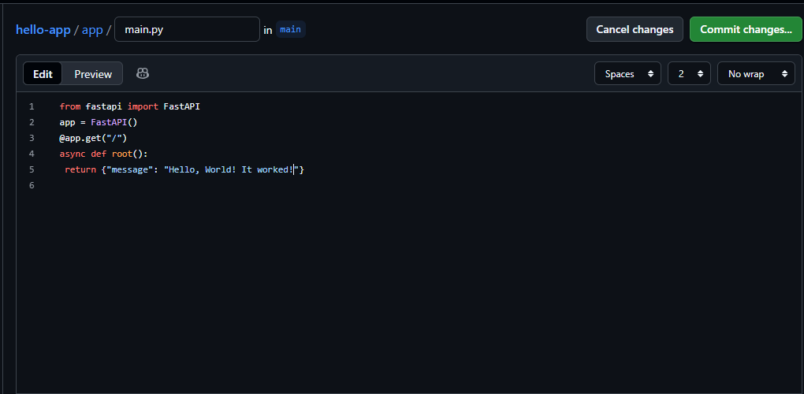  
e dê commit.  
O GitHub Actions gera uma nova tag SHA para a imagem e, como parte do script de GitOps, cria o Pull Request no repositório dos manifestos com essa nova tag.  
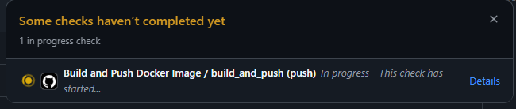  
Depois de um tempo, vai ficar com um sinal de ok, e quando aparecer esse sinal, vá até o repositório dos manifestos e vai ter uma notificação:  
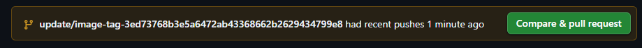  
Clique em ```Compare & pull request```  
Você será levado a essa tela:  
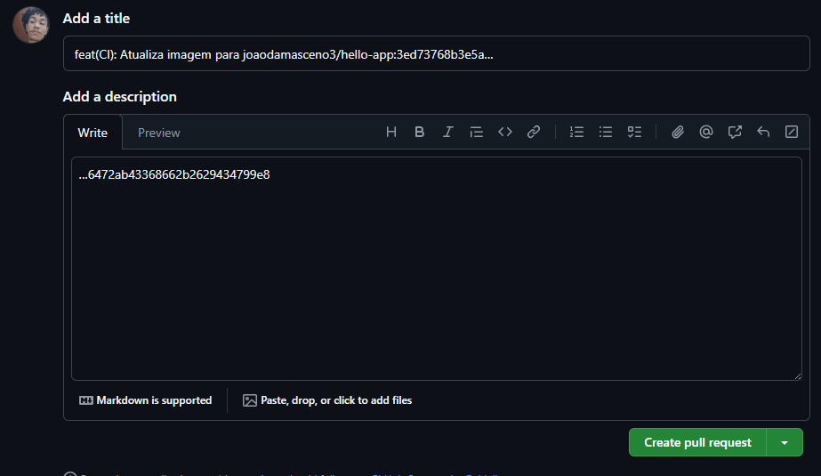  
Clique em ```Create & pull request```  
Agora, você será levado a essa tela:  
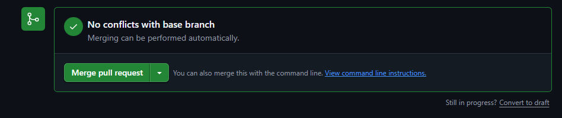  
Clique em ```Merge pull request```  
E nessa última tela:  
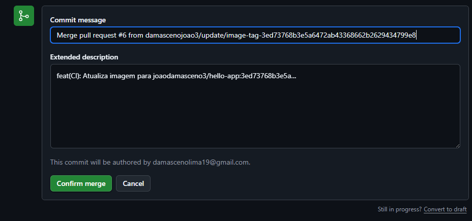  
Clique em ```Confirm merge```  
E pronto, você agora sabe como atualizar sua imagem! inclusive, pode voltar a fazer o port-forwarding e verá suas mudanças:  
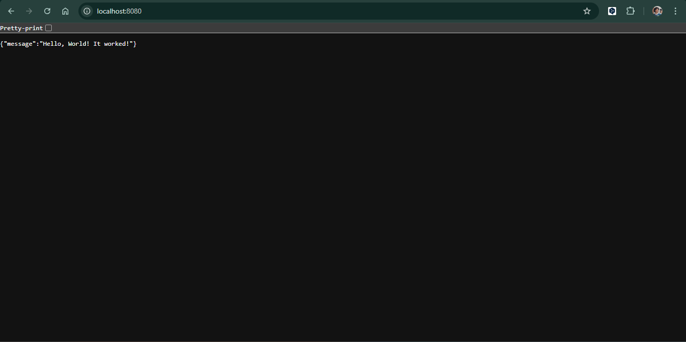  
Inclusive, a imagem sempre é atualizada no Docker Hub:  
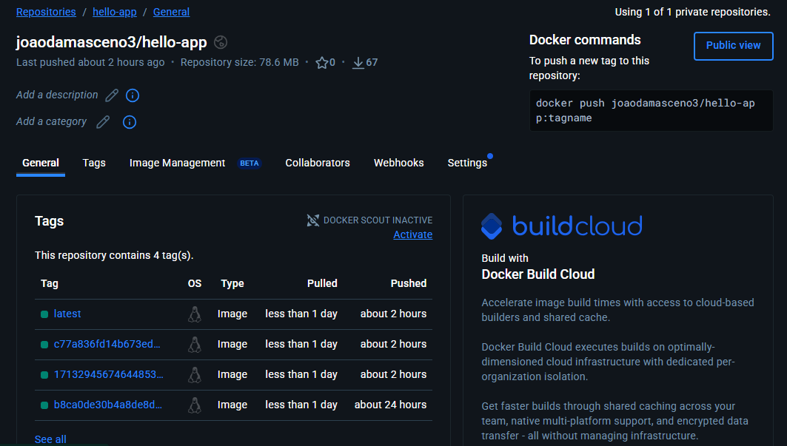  

É isso. Agora, você já sabe simular o CI/CD!
